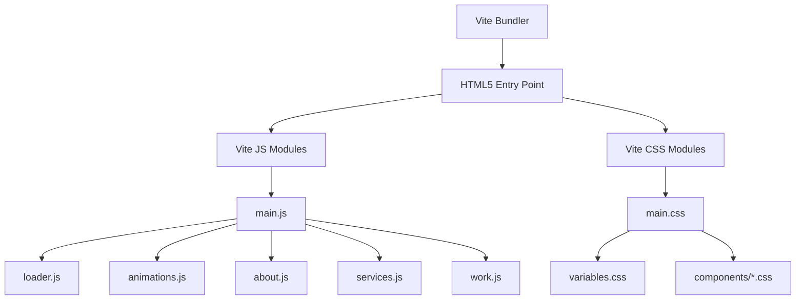

# VOID Studio — Project Context & Technical Blueprint

This document serves as the central design registry, technical specification, and architectural map for **VOID Studio**, a high-fidelity creative development and digital design agency showcase.

---

## 1. Project Overview & Core Mission

VOID Studio is designed to stand out through **uncompromising brutalist dark-mode aesthetics**, fluid micro-interactions, and hardware-accelerated motion choreography. 

The application is built on top of a vanilla frontend architecture, using **Vite** for optimized bundling and **GSAP (GreenSock Animation Platform)** to drive high-performance animations, scroll effects, and layout transformations.

### Key Creative Objectives:
* **Rich Visual Depth**: Seamless combination of dark surface elevations, neon accents (`--clr-lime`), dynamic backdrop filters, and subtle noise overlays.
* **Fluid Mechanics**: Programmatic smooth scrolling via **Lenis**, keeping animations synced directly to the user's natural scroll speed.
* **No "Patch Work"**: Structured, component-level CSS files, semantic HTML layout trees, and responsive styles that naturally scale instead of stacking media query overrides.

---

## 2. Technical Architecture & Stack

### Core Libraries
* **GSAP Core + Plugins**:
  * `ScrollTrigger`: Controls all scroll-linked animations, section pinning, and progress updates.
  * `Flip`: Powers the full-screen interactive project detail view.
  * `SplitText`: Handles splitting text into letters and words for cinematic character reveals.
* **Lenis**: Controls smooth scroll telemetry and momentum.
* **Three.js**: Powering advanced WebGL backdrop visual integrations.

---

## 3. Design Tokens & Styling System

The application's design variables are registered globally in variables.css.

### Color System
| Token Name | Value | Purpose |
| :--- | :--- | :--- |
| `--clr-bg` | `hsl(0, 0%, 4%)` | Primary page backdrop |
| `--clr-bg-elevated` | `hsl(0, 0%, 7%)` | Cards and section dividers |
| `--clr-border` | `hsl(0, 0%, 16%)` | Tech grid lines, panel edges |
| `--clr-text` | `hsl(0, 0%, 93%)` | Primary high-contrast text |
| `--clr-text-muted` | `hsl(0, 0%, 55%)` | Subtitle and body description |
| `--clr-text-subtle` | `hsl(0, 0%, 35%)` | Meta labels, coordinates, brackets |
| `--clr-accent` | `hsl(262, 83%, 64%)` | Neon violet highlight |
| `--clr-lime` | `#c8ff00` | High-contrast neon highlights |

### Typography System
* **Display Headers**: `Outfit`, sans-serif (Font Weight `900` / `700`)
* **Body / System**: `Inter`, sans-serif
* **Mono / Telemetry**: `JetBrains Mono` / `Fira Code`, monospace

---

## 4. Feature Registries

### A. Preloader Curtain & Counter
* **Logic**: Syncs directly with browser lifecycle events (parsing → loading → ready). Runs counter up to `90%`, waits for active fonts and stylesheet attachments, and then snaps to `100%` on `window.onload`.
* **Exit Animation**: Slides a dual-panel vertical curtain upward with custom ease, initializing main page interactions.
* **Duration**: 4-second loading window for transition pacing.

### B. Horizontal Work Track (Work Section)
* **Mechanics**: Pins the `.work` section container and shifts the card track horizontally via GSAP ScrollTrigger.
* **Details View**: Clicking a project card stops page scroll, triggers a **GSAP FLIP transition** on the card's image to expand fullscreen, and details the project content.

### C. Overlapping Services Cards (Services Section)
* **Mechanics**: Desktop sticky stack mechanism where cards stick sequentially at `top: 7.5rem` and scale/fade down as newer cards overlap them.

### D. Geometric Accent Framework
* **12-Column Overlay Grid**: Vertical lines running across the layouts with subtle opacities for alignment.
* **Rotating Vector Wireframes**: Slowly floating SVG wireframes (Icosahedron, Hexagon, Target Rings) in the background of Hero, About, and Culture.
* **Corner Brackets**: Tech framing brackets (`+`) added to interactive cards that highlight in neon lime on hover.
* **Telemetry Markers**: Small, monospace system coordinate text panels indicating latitude, active nodes, and rendering states.

---

## 5. Development Log & Recent Hardening

1. **Manifesto Eyebrow Refactor**: Removed `data-reveal` attribute and integrated eyebrow fade-in directly into the pinned section's timeline to prevent ScrollTrigger offsets.
2. **Work Preview FLIP Bug Fix**: Resolved CSS target mapping to use `.work__img-container` during the modal view state, correcting fullscreen dimensions.
3. **Lets Talk Ticker Cleanup**: Removed the marquee container from `index.html` and cleared out unused ticker CSS from `contact.css` to clean up the section footer.
4. **Lenis Global Access**: Exposed `window.lenis` in `main.js` to allow external tools and automated scripts to programmatically pause or trigger scrolling.
